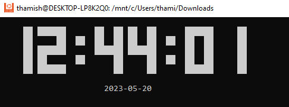

# Digital-Clock

## A digital clock that prints the current time, and date on the linux terminal. If a color is given as an argument to the program, the program will print a colored output. 

## The below requirements were fulfilled.

1. Get user inputs as arguments
2. Get the current system time
3. Get the current system time as a string
4. Print the time
5. Print the date
6. Assign a color to printed characters
7. Error handling for the program

### Program output for: ./source_code

### Program output for: ./source_code -c red

